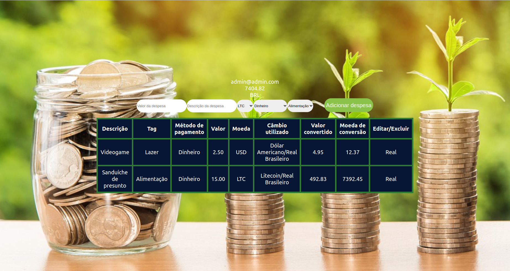

# Trybewallet

Projeto Carteira Pessoal
Este projeto consiste em uma aplicação web para gerenciamento de despesas pessoais. A aplicação possui uma página inicial de login com os campos "E-mail" e "Senha", onde o usuário deve informar suas credenciais para acessar a página principal da carteira.

Na página principal, foi desenvolvido um header contendo as informações do usuário e o saldo atual da carteira. Além disso, há um formulário para adicionar uma nova despesa com os campos "Data", "Categoria", "Descrição" e "Valor". As informações preenchidas no formulário são salvas no estado global da aplicação.

A aplicação também conta com uma tabela de gastos que exibe as despesas adicionadas pelo usuário, contendo as colunas "Data", "Categoria", "Descrição" e "Valor". A tabela é atualizada automaticamente a cada nova despesa adicionada pelo usuário.

Para garantir a qualidade da aplicação, foram desenvolvidos testes unitários para atingir 60% de cobertura total da aplicação. Além disso, a lógica para alimentar a tabela com as informações do estado global da aplicação também foi testada.

Por fim, a aplicação foi refinada para atingir 90% de cobertura total, garantindo maior confiabilidade e segurança no gerenciamento das despesas pessoais.

<details>
  <summary>Lista de habilidades utilizadas no projeto</summary>
  
  - Criar um store Redux em aplicações React;
  - Criar reducers no Redux em aplicações React;
  - Criar actions no Redux em aplicações React;
  - Criar dispatchers no Redux em aplicações React;
  - Conectar Redux aos componentes React;
  - Criar actions assíncronas na sua aplicação React que faz uso de Redux.
  
</details>

## Rodando localmente

Clone o projeto

```bash
  git clone git@github.com:MarcoViana0303/project-trybewallet.git
```

Entre no diretório do projeto

```bash
  cd project-trybewallet
```

Instale as dependências

```bash
  npm install
```

Inicie o servidor

```bash
  npm run start
```

## Ilustração do projeto

## Tela de Login

## Tela de despesas


## Feedback

Alguma dúvida ou encontrou algum problema no código? Não deixe de entrar em contato comigo!


## 🔗 Links
[](https://marcoviana-dev.vercel.app/)
[](https://www.linkedin.com/in/marco-viana2022/)


